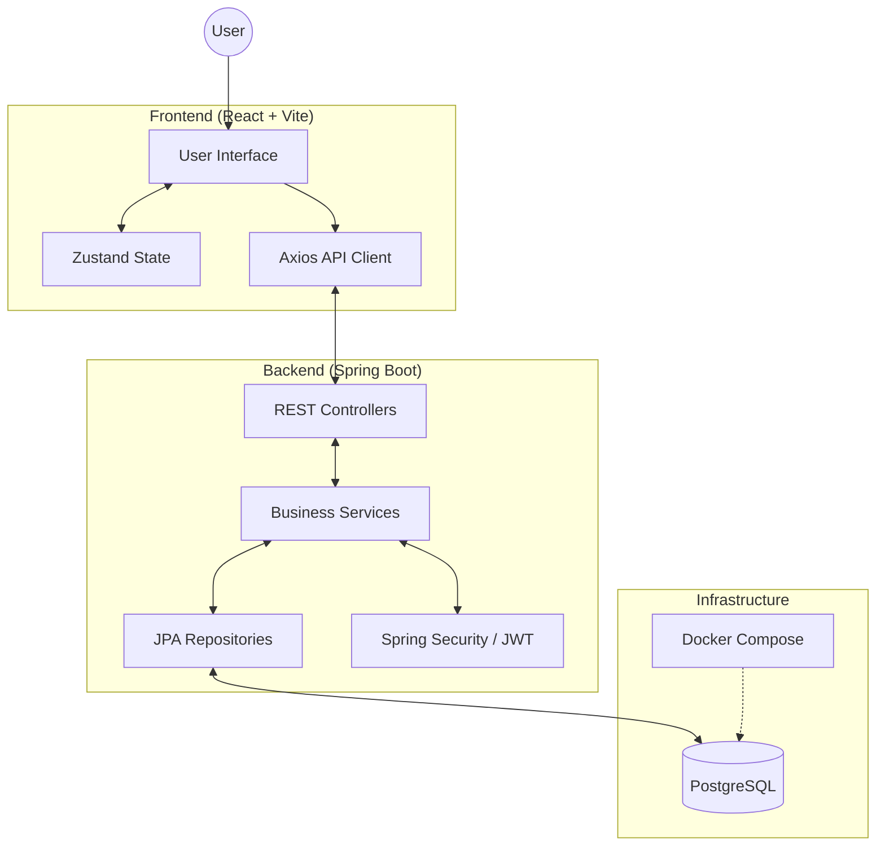

# System Architecture - Mrs. Deore's Platform

This document outlines the architectural design and technology stack of the Mrs. Deore's Platform.

## High-Level Overview

The system follows a classic **Client-Server Architecture** with a dedicated React-based frontend and a Java Spring Boot backend.

---

## 🏗️ Technical Stack

### **Frontend**
- **Framework**: [React 19](https://react.dev/)
- **Build Tool**: [Vite](https://vitejs.dev/)
- **Language**: [TypeScript](https://www.typescriptlang.org/)
- **Styling**:
    - [Tailwind CSS 4](https://tailwindcss.com/) (Main design system)
    - [Bootstrap 5](https://getbootstrap.com/) (Grid and legacy components)
    - [Framer Motion](https://www.framer.com/motion/) (Animations)
- **State Management**: [Zustand](https://zustand-demo.pmnd.rs/) (Lightweight, external store)
- **Routing**: [React Router Dom 7](https://reactrouter.com/)
- **HTTP Client**: [Axios](https://axios-http.com/)

### **Backend**
- **Framework**: [Spring Boot 3.4.2](https://spring.io/projects/spring-boot)
- **Language**: Java 17
- **Security**: Spring Security with **JWT (JSON Web Tokens)** for stateless authentication.
- **Database**: [PostgreSQL 16](https://www.postgresql.org/)
- **Persistence**: Spring Data JPA with Hibernate.
- **Migrations**: [Flyway](https://flywaydb.org/) for database versioning.
- **Integrations**:
    - **Payment**: Razorpay (Java SDK)
    - **Email**: Spring Mail Starter
- **Utilities**: Lombok (Code generator), Jackson (JSON processing).

---

## 🏛️ Architectural Patterns

### **Backend: Layered Architecture**
The backend is organized into standard functional layers to promote separation of concerns:
1.  **Web Layer (`controllers`)**: Handles HTTP requests, input validation, and maps DTOs to internal models.
2.  **Service Layer (`services`)**: Contains the core business logic and transaction management.
3.  **Persistence Layer (`repository`)**: Manages data access using JPA repositories.
4.  **Domain Model (`models`)**: Defines the data entities and relationships.
5.  **Payloads (`payload`)**: Contains Data Transfer Objects (DTOs) for external communication.

### **Frontend: Component-Based Architecture**
The frontend is structured to be modular and scalable:
- **Pages**: Top-level route components.
- **Components**: Reusable UI units (buttons, cards, forms).
- **Services**: Centralized API call logic.
- **Store**: Global application state managed by Zustand.
- **Layouts**: Shared structural envelopes for different application sections (Auth vs. Admin).

---

## 🔐 Security and Authentication
The system uses a stateless authentication model:
1.  User authenticates via login endpoint.
2.  Server validates credentials and issues a signed **JWT**.
3.  Client stores the token and includes it in the `Authorization: Bearer` header for subsequent requests.
4.  Backend `SecurityFilter` intercepting requests to validate the JWT.

---

## 📦 Deployment and Infrastructure
- **Containerization**: Docker Compose is used to orchestrate the PostgreSQL database environment.
- **Local Dev**: Gradle/Maven for local builds, Vite dev server for frontend hot-reloading.
